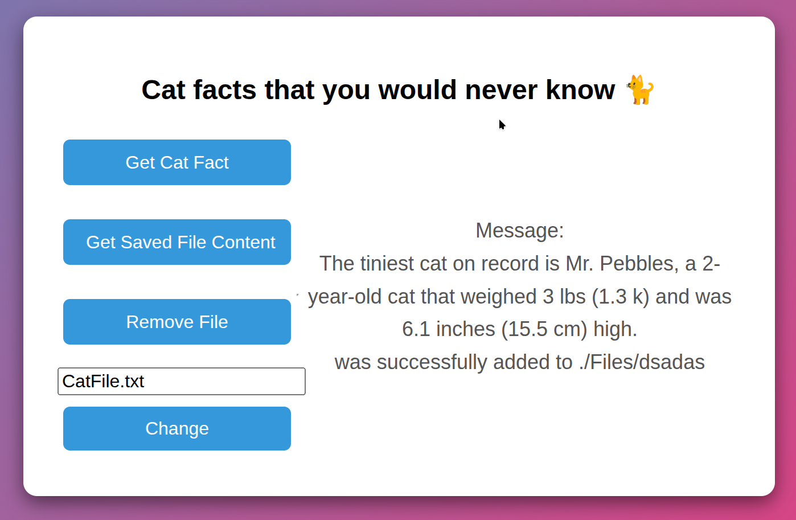

# 🐱 Cat Fact App

## 📌 Wstęp

> **Cat Fact App** to prosta aplikacja webowa umożliwiająca pobieranie, zapisywanie oraz zarządzanie ciekawostkami o kotach. Użytkownik może:
>
> * dodać nową ciekawostkę do pliku,
> * wyświetlić zawartość pliku,
> * usunąć zapisane dane,
> * oraz dynamicznie zmienić nazwę pliku, w którym są przechowywane dane.

## 📂 Ścieżki API

| Ścieżka           | Opis                                                               |
| ----------------- | ------------------------------------------------------------------ |
| `/`               | Widok główny aplikacji                                             |
| `/appendCatFact`  | Pobiera losową ciekawostkę o kotach i zapisuje ją do pliku         |
| `/fetchCatFact`   | Odczytuje i zwraca zawartość pliku z zapisanymi ciekawostkami      |
| `/removeCatFact`  | Usuwa plik zawierający zapisane ciekawostki                        |
| `/updateFileName` | Pozwala zmienić nazwę pliku poprzez formularz na stronie frontowej |

 

